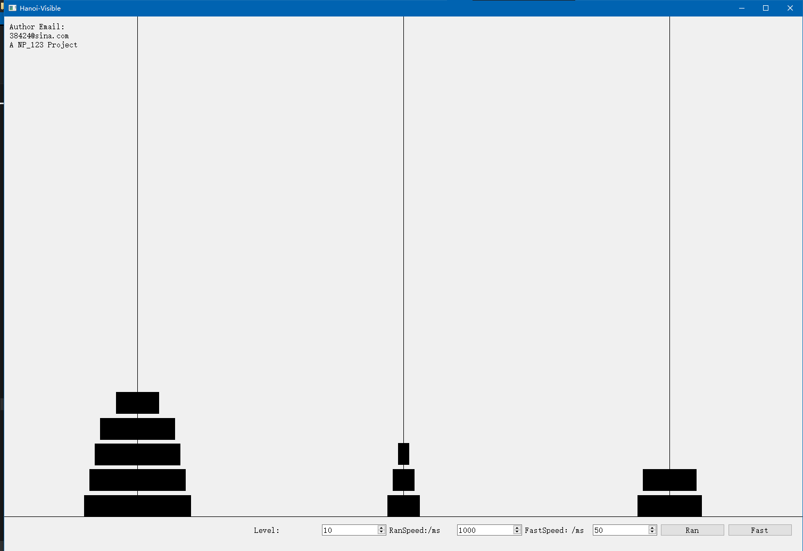

# Hanoi-Visible (Qt C++)

A lightweight Qt C++ project that visualizes the classic **Tower of Hanoi**.

run

```
Hanoi-Visble\Hanoi\release\Hanoi.exe
```



## Features

- Supports **2–20 levels**
- **Random Mode**: simulate the time needed using pure random moves
- **Fast Mode**: visualize the optimal recursive solution
- Adjustable **step delay** to clearly observe each move
- Clean, beginner-friendly UI

## How It Works

- **Random Mode** performs completely random disc moves and measures how long it takes to finish.
- **Fast Mode** uses the standard recursive algorithm to show the optimal solution.

## Author

Email: **[np123greatest@gmail.com](mailto:np123greatest@gmail.com)**

Thanks for checking out the project!
